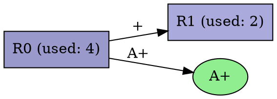

# Orbweaver Output Formats

Orbweaver can output the generated grammar in several formats using command-line flags.

**Default Output Behavior:**
When specific paths are not provided for key output formats (JSON, FASTA rule blocks, Tabular Repeats, DOT, GraphML), Orbweaver will generate them with default names (e.g., `grammar.json`, `rules.fasta`) within a run-specific directory. This directory is typically `./<species_id>/<run_id>/`, where `<species_id>` is derived from the input filename.

## 1. JSON (`--output-json <PATH>`)

This format provides a direct serialization of the internal grammar representation using `serde_json`.

```json
{
  "sequence": [
    {
      "id": 10,
      "symbol_type": {
        "NonTerminal": 0
      },
      "strand": "+"
    },
    {
      "id": 11,
      "symbol_type": {
        "NonTerminal": 0
      },
      "strand": "+"
    }
    // ... more symbols in the final compressed sequence
  ],
  "rules": {
    "0": {
      "id": 0,
      "symbols": [
        {
          "id": 0,
          "symbol_type": {
            "Terminal": 65 // ASCII for 'A'
          },
          "strand": "+"
        },
        {
          "id": 1,
          "symbol_type": {
            "Terminal": 67 // ASCII for 'C'
          },
          "strand": "+"
        }
      ],
      "usage_count": 4,
      "depth": 1
    },
    "1": {
       // ... definition for Rule 1 ...
    }
    // ... more rules 
  },
  "max_depth": 3
}
```

*   `sequence`: An array of `Symbol` objects representing the compressed sequence after all rule replacements.
*   `rules`: A map where keys are rule IDs (as strings) and values are `Rule` objects.
*   `Symbol`: Contains the instance `id` (its original position or ID context), `symbol_type` (`Terminal` with ASCII value or `NonTerminal` with rule ID), and `strand` (`+` or `-`).
*   `Rule`: Contains the rule `id`, the `symbols` it expands to, its `usage_count`, and its hierarchical `depth` in the grammar.
*   `max_depth`: The maximum depth of any rule in the grammar.

**Note on Merged Grammars and Rule Origins:**
When processing multiple input files, Orbweaver merges the resulting grammars. The internal `Grammar` structure contains an `origins` field (a map from a final merged rule ID to a list of `(source_grammar_id, original_rule_id)` tuples). This field helps trace rules back to their source grammars before merging. Currently, this `origins` field is marked with `#[serde(skip)]` and is not included in the JSON output, but it's an important aspect of how multi-genome comparisons are handled internally.

## 2. Tabular Repeat Summary (`--output-repeats <PATH>`)

This option generates a tab-separated values (TSV) file summarizing identified repeats. This format is convenient for quick review and import into spreadsheet software.

```tsv
RuleID	UsageCount	ExpandedLength	Sequence(Preview)
R0	5	120	GATTACA...
R17	3	88	CGCGCGC...
...
```

The columns are:

*   **RuleID**: The identifier of the rule (e.g., `R0`, `R17`).
*   **UsageCount**: The number of times this rule (and thus the repeat it represents) appears in the final compressed sequence(s). A simple heuristic might define a repeat as any rule with `UsageCount >= 2`.
*   **ExpandedLength**: The total length of the DNA sequence when this rule is fully expanded to its terminal bases.
*   **Sequence(Preview)**: A short preview of the fully expanded DNA sequence of the rule (e.g., the first 50 bases).

The repeats are typically sorted by `UsageCount` in descending order.

## 3. GFAv1 (`--output-gfa <PATH>`)

Graphical Fragment Assembly format, version 1. This output represents the grammar structure as a graph.

*   **H Line**: Standard GFA header (`H\tVN:Z:1.0`).
*   **S Lines**: Each rule is represented as a segment (`S`).
    *   `<sid>`: The rule ID (e.g., `0`, `1`).
    *   `<sequence>`: The fully reconstructed DNA sequence of the rule.
    *   `LN:i:<len>`: Optional tag indicating the length of the reconstructed sequence.
    *   Example: `S\t0\tACGT\tLN:i:4`
*   **L Lines**: Links represent the adjacency of symbols within a rule definition (`Rule R -> S1 S2`).
    *   `<sid1>`: Segment ID of the first symbol (e.g., `R0`, `T_A+`).
    *   `<orient1>`: Strand of the first symbol (`+` or `-`).
    *   `<sid2>`: Segment ID of the second symbol.
    *   `<orient2>`: Strand of the second symbol.
    *   `<overlap>`: `0M` (zero overlap, indicating adjacency).
    *   Example: `L\tR0\t+\tR1\t-\t0M` (Link from rule R0 to rule R1 with opposite strand)
    *   Example: `L\tR0\t+\tT_C+\t+\t0M` (Link from rule R0 to terminal C+)

The GFA output can be visualized using tools like Bandage (https://rrwick.github.io/Bandage/).

## 4. Text (`--output-text <PATH>`)

A human-readable text format describing the final sequence and rules.

```text
== Final Sequence (3 symbols) ==
R0+ R1- R0+

== Rules (2 total) ==
R0 [Usage=2] -> A+ C+
R1 [Usage=1] -> R0+ G-
```

*   **Final Sequence**: Shows the sequence of symbols (Terminals like `A+`, NonTerminals like `R0-`) remaining after compression. Line wrapping may occur.
*   **Rules**: Lists each rule definition.
    *   `R<id>`: The rule identifier.
    *   `[Usage=<count>]`: The number of times this rule was used (replaced digrams).
    *   `-> Symbol1 Symbol2 ...`: The sequence of symbols the rule expands to.

## 5. FASTA (`--export-blocks <PATH>`)

Exports the fully expanded DNA sequence for each rule in standard FASTA format.

```fasta
>Rule_0 [Usage=4] depth=1
ACGTACGT
>Rule_1 [Usage=2] depth=2
TTGC
>Rule_2_ERROR [Usage=1]
Error reconstructing sequence: Cycle detected involving rule 2
```

*   Each record corresponds to one rule.
*   The header line includes `Rule_<id>`, `Usage=<count>`, and `depth=<depth>`.
*   The sequence is the fully expanded DNA sequence for that rule.
*   If an error occurs during reconstruction (e.g., a cycle is detected), an error record is written instead.

## 6. DOT (`--visualize <PATH>`)

Generates a DOT file for visualization with Graphviz tools.



The DOT file represents the grammar as a directed graph where:
- Rules are represented as box-shaped nodes
- Terminals are represented as ellipse-shaped nodes
- Edges represent the expansion of rules
- Colors can represent rule depth (darker colors for deeper rules)
- Edge labels show strand information

To generate an image from the DOT file:

```bash
dot -Tpng grammar.dot -o grammar.png
# or
dot -Tsvg grammar.dot -o grammar.svg
```

## Custom Format Extensions

Orbweaver supports custom format extensions through code modifications. The extension points are:

1. Implement a new writer function in the `io/` module
2. Add a new enum variant to `OutputFormat` in `utils/io.rs`
3. Update the argument parsing in `main.rs` to accept the new format

The current output formats are all implemented via these extension points, making it straightforward to add new formats as needed. 